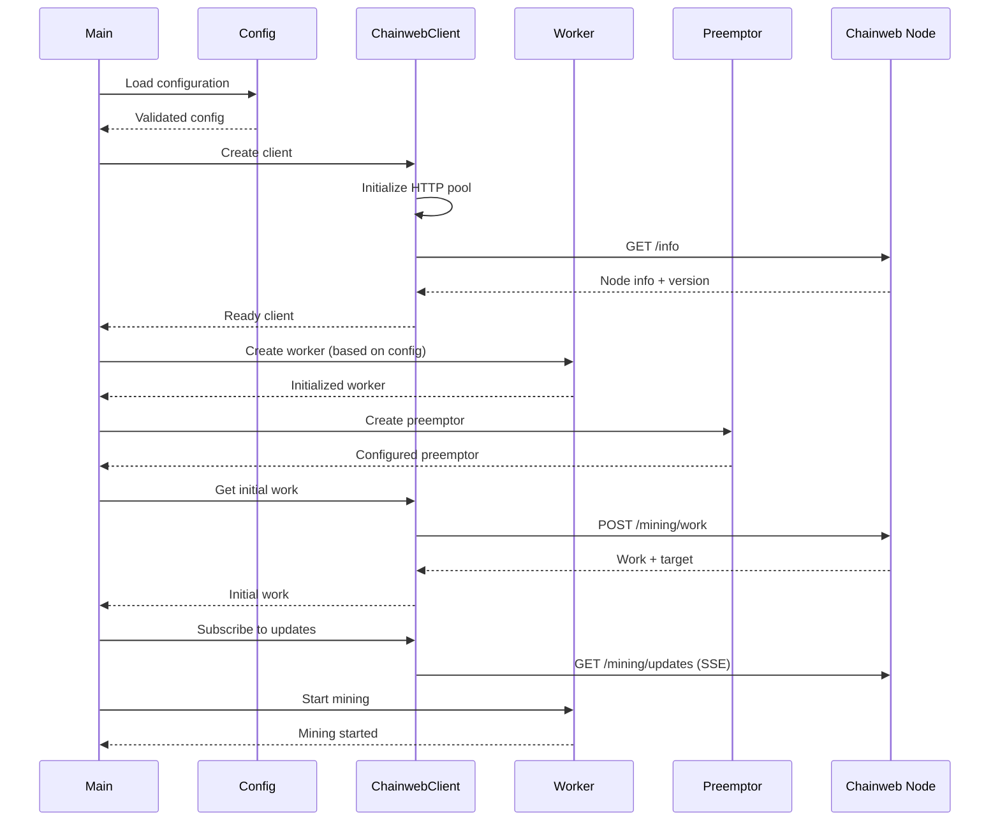
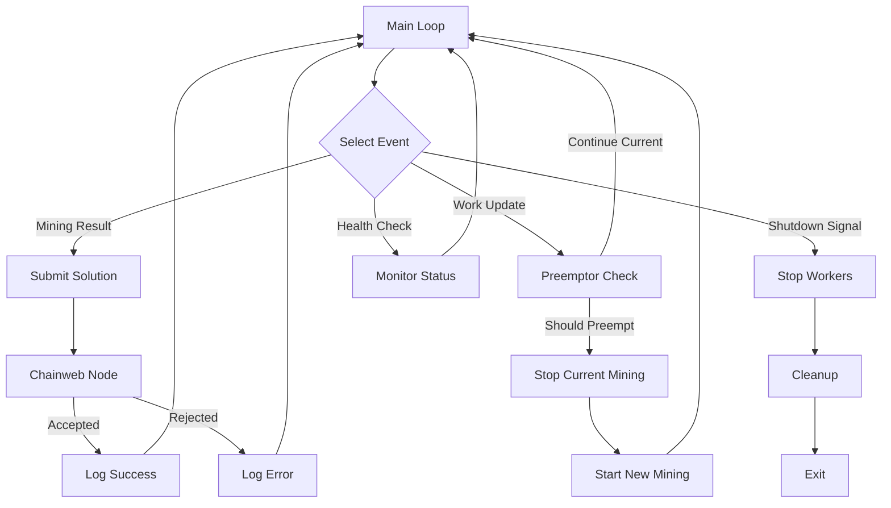

# Chainweb Mining Client Architecture

This document provides a comprehensive overview of the Chainweb mining client's architecture, including internal design, protocols, and component interactions.

## Table of Contents

- [Core Architecture Overview](#core-architecture-overview)
- [Chainweb Node Connection](#chainweb-node-connection)
- [Worker System Architecture](#worker-system-architecture)
- [Mining Flow & Work Management](#mining-flow--work-management)
- [Configuration Architecture](#configuration-architecture)
- [Core Data Structures](#core-data-structures)
- [Protocol Implementation](#protocol-implementation)
- [Performance Optimizations](#performance-optimizations)
- [Component Interactions](#component-interactions)
- [Development and Testing](#development-and-testing)

## Core Architecture Overview

The Chainweb mining client follows a **modular, async-first architecture** built on Tokio with pluggable worker systems. The design emphasizes:

- **Performance**: SIMD optimizations, connection pooling, zero-copy protocols
- **Modularity**: Trait-based worker system supporting multiple mining strategies  
- **Reliability**: Comprehensive error handling, retry logic, graceful degradation
- **Flexibility**: Hierarchical configuration, multiple deployment modes

### High-Level Architecture

```
┌─────────────────┐    ┌──────────────────┐    ┌─────────────────┐
│   main.rs       │    │ ChainwebClient   │    │ Chainweb Node   │
│ (Orchestrator)  │◄──►│ (Protocol Layer) │◄──►│ (Remote)        │
└─────────────────┘    └──────────────────┘    └─────────────────┘
         │                       │
         ▼                       ▼
┌─────────────────┐    ┌──────────────────┐
│ Worker System   │    │ Work Preemptor   │
│ (Mining Logic)  │    │ (Smart Updates)  │
└─────────────────┘    └──────────────────┘
         │                       │
         ▼                       ▼
┌─────────────────┐    ┌──────────────────┐
│ Core Types      │    │ Configuration    │
│ (Work/Target)   │    │ (Settings)       │
└─────────────────┘    └──────────────────┘
```

### Directory Structure

```
src/
├── main.rs              # CLI entry point and orchestration
├── lib.rs               # Library exports and public API
├── error.rs             # Comprehensive error types
├── core/                # Core types and functionality
│   ├── mod.rs           # Core exports and constants
│   ├── work.rs          # Work header representation
│   ├── target.rs        # Mining difficulty targets
│   ├── nonce.rs         # Nonce handling
│   ├── chain_id.rs      # Kadena chain identifiers
│   ├── hash_simd.rs     # SIMD-optimized hashing
│   └── preemption.rs    # Smart work update logic
├── protocol/            # Chainweb node communication
│   ├── mod.rs           # Protocol exports
│   ├── chainweb.rs      # Main client implementation
│   ├── http_pool.rs     # Connection pooling
│   └── retry.rs         # Retry logic and backoff
├── workers/             # Mining worker implementations
│   ├── mod.rs           # Worker trait and common types
│   ├── cpu.rs           # Multi-threaded CPU mining
│   ├── external.rs      # External program interface
│   ├── constant_delay.rs # Development mode worker
│   ├── simulation.rs    # Simulated mining
│   ├── on_demand.rs     # HTTP-triggered mining
│   └── stratum/         # Stratum protocol for ASICs
│       ├── mod.rs       # Stratum exports
│       ├── server.rs    # TCP server implementation
│       ├── protocol.rs  # JSON-RPC message handling
│       ├── session.rs   # Individual connections
│       ├── job.rs       # Work distribution
│       └── difficulty.rs # Difficulty adjustments
├── config/              # Configuration management
│   └── mod.rs           # Hierarchical config system
└── utils/               # Utility modules
    ├── mod.rs           # Utility exports
    ├── logging.rs       # Structured logging setup
    ├── monitoring.rs    # Performance monitoring
    └── units.rs         # Unit parsing (K, M, G, etc.)
```

## Chainweb Node Connection

### ChainwebClient (`src/protocol/chainweb.rs`)

The connection layer implements a sophisticated HTTP-based protocol:

```rust
pub struct ChainwebClient {
    config: ChainwebClientConfig,
    client: Arc<Client>,      // Pooled HTTP client
    node_version: Option<String>,
}
```

### Connection Features

- **HTTP Connection Pool**: Reuses connections via `reqwest::Client` for efficiency
- **TLS Support**: Configurable HTTPS with optional certificate validation
- **Server-Sent Events**: Real-time work updates via `/mining/updates` endpoint
- **Binary Protocol**: Efficient 322-byte work response format
- **Retry Logic**: Built-in exponential backoff for network failures

### Protocol Endpoints

| Endpoint | Method | Purpose |
|----------|--------|---------|
| `/info` | GET | Node capabilities and version detection |
| `/chainweb/0.0/{version}/mining/work` | POST | Binary work requests |
| `/chainweb/0.0/{version}/mining/solved` | POST | Solution submissions |
| `/chainweb/0.0/{version}/mining/updates` | GET | SSE work update stream |

### Binary Work Format

The protocol uses a compact binary format for efficiency:

```
Total: 322 bytes
┌─────────────┬──────────────────┬──────────────────────────┐
│ Chain ID    │ Target           │ Work Header              │
│ (4 bytes)   │ (32 bytes)       │ (286 bytes)              │
│ LE u32      │ 256-bit LE       │ Includes 8-byte nonce    │
└─────────────┴──────────────────┴──────────────────────────┘
                                  └─ Nonce at offset 278-285
```

### Connection Lifecycle

```rust
// 1. Initialize client with configuration
let client = ChainwebClient::new(config)?;

// 2. Get node information and detect version
let node_info = client.get_info().await?;

// 3. Request initial work
let initial_work = client.get_work(account, predicate, public_keys).await?;

// 4. Subscribe to work updates
let work_stream = client.subscribe_work_updates().await?;

// 5. Submit solutions
client.submit_work(&solution).await?;
```

## Worker System Architecture

### Core Worker Trait (`src/workers/mod.rs`)

All mining strategies implement a unified async interface:

```rust
#[async_trait]
pub trait Worker: Send + Sync {
    async fn mine(
        &self, 
        work: Work, 
        target: Target, 
        result_tx: mpsc::Sender<MiningResult>
    ) -> Result<()>;
    
    async fn stop(&self) -> Result<()>;
    fn worker_type(&self) -> &str;
    async fn hashrate(&self) -> u64;
}
```

### Worker Types

#### 1. CPU Worker (`src/workers/cpu.rs`)

**Purpose**: High-performance multi-threaded CPU mining

**Architecture**:
- **SIMD Optimizations**: Vectorized Blake2s-256 hashing via `VectorizedMiner`
- **Memory Pools**: `NonceBufferPool` reduces allocations in hot paths
- **Parallel Processing**: Rayon-based work distribution across cores
- **Adaptive Batching**: Dynamic batch sizing based on target difficulty

```rust
pub struct CpuWorker {
    config: CpuWorkerConfig,
    miner: Arc<VectorizedMiner>,
    stop_flag: Arc<AtomicBool>,
}

pub struct CpuWorkerConfig {
    pub threads: usize,      // 0 = auto-detect
    pub batch_size: u64,     // Nonces per batch
}
```

**Mining Process**:
1. Split nonce space across worker threads
2. Each thread processes batches of nonces
3. Use SIMD instructions for parallel hashing
4. Check results against target
5. Send solutions via channel

#### 2. Stratum Server (`src/workers/stratum/`)

**Purpose**: ASIC miner coordination via industry-standard Stratum protocol

**Components**:
- **`server.rs`**: TCP server with session management
- **`protocol.rs`**: JSON-RPC 2.0 message handling
- **`session.rs`**: Individual miner connection state
- **`job.rs`**: Work distribution and job lifecycle management  
- **`difficulty.rs`**: Dynamic difficulty adjustment algorithms

**Key Stratum Messages**:
```rust
pub enum StratumMethod {
    Subscribe,    // Initial connection: mining.subscribe
    Authorize,    // Authentication: mining.authorize  
    Submit,       // Share submission: mining.submit
    SetDifficulty,// Difficulty update: mining.set_difficulty
    Notify,       // New work: mining.notify
}
```

**Protocol Flow**:
```
Miner                    Stratum Server
  │                           │
  │── mining.subscribe ───────┤
  │                           │
  │◄─ subscription_id ────────┤
  │                           │
  │── mining.authorize ───────┤
  │                           │
  │◄─ authorization result ───┤
  │                           │
  │◄─ mining.set_difficulty ──┤
  │                           │
  │◄─ mining.notify ──────────┤ (new work)
  │                           │
  │── mining.submit ──────────┤
  │                           │
  │◄─ submit result ──────────┤
```

**Session Management**:
```rust
pub struct StratumSession {
    id: SessionId,
    socket: TcpStream,
    subscriptions: Vec<String>,
    authorized: bool,
    difficulty: f64,
    extra_nonce1: String,
}
```

#### 3. External Worker (`src/workers/external.rs`)

**Purpose**: Interface with external mining programs (GPU miners, custom miners)

**Features**:
- **Process Management**: Spawns and manages external processes
- **Timeout Handling**: Configurable execution timeouts
- **Environment Setup**: Custom environment variables and arguments
- **Binary Communication**: Work passed via stdin, results from stdout

```rust
pub struct ExternalWorkerConfig {
    pub command: String,           // Executable path
    pub args: Vec<String>,         // Command arguments
    pub env: Vec<(String, String)>, // Environment variables
    pub timeout_secs: u64,         // Execution timeout
}
```

**Process Lifecycle**:
1. Spawn external process with configured environment
2. Write work data to process stdin (binary or hex format)
3. Read mining results from stdout
4. Parse and validate results
5. Handle timeouts and process cleanup

#### 4. Development Workers

**Simulation Worker** (`src/workers/simulation.rs`):
- Configurable hash rate simulation for testing
- Deterministic or random solution generation
- Performance benchmarking and testing

**Constant Delay Worker** (`src/workers/constant_delay.rs`):
- Fixed-interval block emission for development
- Non-PoW testing scenarios
- Returns work unchanged after delay

**On-Demand Worker** (`src/workers/on_demand.rs`):
- HTTP server for manual block generation
- REST API for triggering mining
- Development and testing workflows

## Mining Flow & Work Management

### Main Mining Loop (`src/main.rs`)

The core process orchestrates multiple concurrent operations using `tokio::select!`:

```rust
async fn main_mining_loop(
    worker: Arc<dyn Worker>,
    client: Arc<ChainwebClient>,
    mut work_stream: WorkUpdateStream,
    config: &Config,
) -> Result<()> {
    let (result_tx, mut result_rx) = mpsc::channel(100);
    let mut current_work = client.get_work(&config.mining.account, 
                                           &config.mining.predicate, 
                                           &config.mining.public_keys).await?;
    
    // Start initial mining
    let worker_clone = Arc::clone(&worker);
    let mining_task = tokio::spawn(async move {
        worker_clone.mine(current_work, target, result_tx).await
    });
    
    loop {
        tokio::select! {
            // Handle mining results
            Some(result) = result_rx.recv() => {
                match client.submit_work(&result.work).await {
                    Ok(_) => info!("Solution accepted!"),
                    Err(e) => warn!("Solution rejected: {}", e),
                }
            }
            
            // Handle work updates via SSE
            Some(update) = work_stream.next() => {
                if preemptor.should_preempt(&current_work, &update.work)? {
                    // Stop current mining
                    worker.stop().await?;
                    
                    // Start mining new work
                    current_work = update.work;
                    let new_task = tokio::spawn(/* new mining task */);
                    mining_task = new_task;
                }
            }
            
            // Handle shutdown signals
            _ = shutdown_rx.recv() => {
                worker.stop().await?;
                break;
            }
        }
    }
    
    Ok(())
}
```

### Work Preemption System (`src/core/preemption.rs`)

Sophisticated work update management with configurable strategies:

```rust
pub struct WorkPreemptor {
    config: PreemptionConfig,
    last_preemption: Instant,
    stats: PreemptionStats,
}

pub enum PreemptionStrategy {
    Immediate,              // Stop mining immediately
    BatchComplete,          // Finish current batch
    Delayed(Duration),      // Wait then switch
    Conditional,            // Switch only if work significantly different
}

pub struct PreemptionConfig {
    pub strategy: PreemptionStrategy,
    pub min_preemption_interval: Duration,  // Rate limiting
    pub identical_work_threshold: f64,      // Similarity threshold
}
```

**Preemption Decision Logic**:
```rust
impl WorkPreemptor {
    pub fn should_preempt(&mut self, current: &Work, new: &Work) -> Result<bool> {
        // Rate limiting check
        if self.last_preemption.elapsed() < self.config.min_preemption_interval {
            return Ok(false);
        }
        
        // Work comparison
        if self.is_work_identical(current, new) {
            return Ok(false);
        }
        
        // Strategy-specific logic
        match self.config.strategy {
            PreemptionStrategy::Immediate => Ok(true),
            PreemptionStrategy::Conditional => {
                Ok(self.work_difference_significant(current, new))
            }
            PreemptionStrategy::Delayed(delay) => {
                tokio::time::sleep(delay).await;
                Ok(true)
            }
            PreemptionStrategy::BatchComplete => {
                // Coordinate with worker to finish current batch
                Ok(true)
            }
        }
    }
}
```

**Statistics Tracking**:
- Preemption frequency and timing
- Work similarity analysis
- Mining efficiency metrics
- Strategy effectiveness

## Configuration Architecture

### Hierarchical Configuration System (`src/config/mod.rs`)

```rust
#[derive(Debug, Clone, Serialize, Deserialize)]
pub struct Config {
    pub node: NodeConfig,        // Chainweb node connection
    pub mining: MiningConfig,    // Mining account/keys
    pub worker: WorkerConfig,    // Worker-specific settings
    pub logging: LoggingConfig,  // Tracing configuration
}

#[derive(Debug, Clone, Serialize, Deserialize)]
pub struct NodeConfig {
    pub url: String,             // Node endpoint URL
    pub use_tls: bool,           // HTTPS vs HTTP
    pub timeout_secs: u64,       // Request timeout
    pub chain_id: ChainId,       // Target chain
}

#[derive(Debug, Clone, Serialize, Deserialize)]
pub struct MiningConfig {
    pub account: String,         // Miner account (k:...)
    pub public_key: String,      // Miner public key
    pub predicate: String,       // Key predicate (keys-all, keys-any, etc.)
    pub update_interval_secs: u64, // Work update polling
}
```

### Configuration Priority (highest to lowest)

1. **Command-line arguments** (via `clap`)
2. **Configuration files** (YAML/JSON/TOML via `config` crate)
3. **Remote configuration** (HTTP/HTTPS URLs)
4. **Environment variables**
5. **Default values**

### Worker Configuration

Uses enum variants for type-safe worker-specific settings:

```rust
#[derive(Debug, Clone, Serialize, Deserialize)]
pub enum WorkerConfig {
    Cpu {
        threads: usize,          // 0 = auto-detect
        batch_size: u64,         // Nonces per batch
    },
    External {
        command: String,         // Executable path
        args: Vec<String>,       // Arguments
        env: Vec<(String, String)>, // Environment
        timeout_secs: u64,       // Process timeout
    },
    Stratum {
        port: u16,               // Server port
        host: String,            // Bind address
        max_connections: usize,   // Connection limit
        difficulty: StratumDifficulty, // Difficulty mode
        rate_ms: u64,            // Job update rate
    },
    Simulation {
        hashrate: u64,           // Simulated H/s
        solution_probability: f64, // Success rate
    },
    ConstantDelay {
        block_time_secs: u64,    // Block interval
    },
    OnDemand {
        port: u16,               // HTTP server port
        host: String,            // Bind address
    },
}
```

### Configuration Loading

```rust
impl Config {
    pub fn load() -> Result<Self> {
        let mut builder = config::Config::builder()
            .add_source(config::File::with_name("mining-config").required(false))
            .add_source(config::Environment::with_prefix("CHAINWEB_MINING"));
        
        // Add CLI overrides
        if let Some(config_file) = cli_args.config {
            builder = builder.add_source(config::File::with_name(&config_file));
        }
        
        // Remote configuration support
        if let Some(remote_url) = cli_args.remote_config {
            let remote_config = fetch_remote_config(&remote_url).await?;
            builder = builder.add_source(config::File::from_str(&remote_config, 
                                                                config::FileFormat::Yaml));
        }
        
        builder.build()?.try_deserialize()
    }
}
```

## Core Data Structures

### Work (`src/core/work.rs`)

Represents a 286-byte Chainweb mining header:

```rust
pub struct Work {
    bytes: [u8; WORK_SIZE], // WORK_SIZE = 286
}

impl Work {
    // Header field accessors
    pub fn version(&self) -> u32 { /* bytes 0-3 */ }
    pub fn parent_hash(&self) -> &[u8] { /* bytes 4-35 */ }
    pub fn adjacent_hashes(&self) -> Vec<&[u8]> { /* variable */ }
    pub fn target(&self) -> Target { /* bytes 158-189 */ }
    pub fn timestamp(&self) -> u64 { /* bytes 190-197 */ }
    pub fn nonce(&self) -> Nonce { /* bytes 278-285 */ }
    
    // Nonce manipulation
    pub fn set_nonce(&mut self, nonce: Nonce) { /* write to bytes 278-285 */ }
    pub fn increment_nonce(&mut self) { /* increment in-place */ }
    
    // Hashing
    pub fn hash(&self) -> [u8; 32] {
        let mut hasher = Blake2s256::new();
        hasher.update(&self.bytes);
        hasher.finalize().into()
    }
    
    // Serialization
    pub fn to_hex(&self) -> String { /* hex encoding */ }
    pub fn from_hex(hex: &str) -> Result<Self> { /* hex decoding */ }
}
```

### Target (`src/core/target.rs`)

Represents mining difficulty as a 256-bit target:

```rust
pub struct Target {
    words: [u64; 4], // 256-bit as 4 u64s (little-endian)
}

impl Target {
    pub fn from_bytes(bytes: [u8; 32]) -> Self {
        // Convert little-endian bytes to u64 words
    }
    
    pub fn meets_target(&self, hash: &[u8; 32]) -> bool {
        // Compare hash ≤ target (both little-endian)
        let hash_target = Target::from_bytes(*hash);
        hash_target <= *self
    }
    
    pub fn difficulty(&self) -> f64 {
        // Convert target to difficulty value
        // difficulty = max_target / current_target
    }
    
    pub fn to_hex(&self) -> String { /* hex representation */ }
}
```

### Nonce (`src/core/nonce.rs`)

8-byte mining nonce with atomic operations:

```rust
pub struct Nonce {
    value: u64, // Little-endian 8-byte nonce
}

impl Nonce {
    pub fn new(value: u64) -> Self { Self { value } }
    pub fn increment(&mut self) { self.value = self.value.wrapping_add(1); }
    pub fn to_bytes(&self) -> [u8; 8] { self.value.to_le_bytes() }
    pub fn from_bytes(bytes: [u8; 8]) -> Self {
        Self { value: u64::from_le_bytes(bytes) }
    }
}

// Thread-safe nonce generation
pub struct NonceGenerator {
    counter: AtomicU64,
    thread_id: u64,
}
```

### ChainId (`src/core/chain_id.rs`)

Type-safe Kadena chain identifier:

```rust
pub struct ChainId(u16);

impl ChainId {
    pub const MIN: u16 = 0;
    pub const MAX: u16 = 19; // Kadena has 20 chains (0-19)
    
    pub fn new(id: u16) -> Result<Self> {
        if id <= Self::MAX {
            Ok(Self(id))
        } else {
            Err(Error::InvalidChainId(id))
        }
    }
}
```

### Mining Result Flow

```rust
pub struct MiningResult {
    pub work: Work,      // Original work with updated nonce
    pub nonce: Nonce,    // Winning nonce value
    pub hash: [u8; 32],  // Resulting hash that meets target
}

// Channel communication
type ResultSender = mpsc::Sender<MiningResult>;
type ResultReceiver = mpsc::Receiver<MiningResult>;
```

## Protocol Implementation

### Blake2s-256 Mining Protocol

**Hash Algorithm**: Blake2s-256 (Kadena's choice for better performance than SHA-256)

```rust
use blake2::{Blake2s256, Digest};

fn mine_nonce(work: &Work, target: &Target, start_nonce: u64, batch_size: u64) -> Option<MiningResult> {
    let mut work_copy = work.clone();
    
    for i in 0..batch_size {
        let nonce = Nonce::new(start_nonce + i);
        work_copy.set_nonce(nonce);
        
        let hash = {
            let mut hasher = Blake2s256::new();
            hasher.update(work_copy.bytes());
            hasher.finalize().into()
        };
        
        if target.meets_target(&hash) {
            return Some(MiningResult {
                work: work_copy,
                nonce,
                hash,
            });
        }
    }
    
    None
}
```

**Target Validation**: `hash ≤ target` determines valid solution (both little-endian)

### Stratum Protocol Extensions

**Kadena-specific adaptations**:
- Custom job format for Chainweb work headers
- Target ↔ Stratum difficulty conversion
- Binary work data encoding

```rust
// Stratum difficulty to Chainweb target conversion
pub fn difficulty_to_target(difficulty: f64) -> Target {
    // Stratum difficulty 1.0 = target 0x00000000FFFFFFFF...
    let base_target = 0x00000000FFFFFFFF_u64;
    let target_value = (base_target as f64 / difficulty) as u64;
    Target::from_difficulty(target_value)
}

// Job notification format
pub struct StratumJob {
    pub job_id: String,
    pub previous_hash: String,
    pub coinbase1: String,
    pub coinbase2: String,
    pub merkle_branches: Vec<String>,
    pub version: String,
    pub bits: String,        // Encoded target
    pub timestamp: String,
    pub clean_jobs: bool,
}
```

### HTTP Connection Pooling (`src/protocol/http_pool.rs`)

```rust
pub struct HttpClientPool {
    config: HttpPoolConfig,
    clients: RwLock<HashMap<ClientType, Arc<Client>>>,
    metrics: ConnectionMetrics,
}

#[derive(Debug, Clone, Hash, Eq, PartialEq)]
pub enum ClientType {
    Mining,      // High-performance mining requests
    Config,      // Configuration loading
    Monitoring,  // Health checks and metrics
}

pub struct HttpPoolConfig {
    pub max_connections_per_host: usize,
    pub max_idle_per_host: usize,
    pub connect_timeout: Duration,
    pub request_timeout: Duration,
    pub keep_alive_timeout: Option<Duration>,
    pub user_agent: String,
}
```

### Retry Logic (`src/protocol/retry.rs`)

```rust
pub struct RetryConfig {
    pub max_attempts: usize,
    pub base_delay: Duration,
    pub max_delay: Duration,
    pub exponential_base: f64,
    pub jitter: bool,
}

pub async fn retry_with_backoff<F, Fut, T, E>(
    operation: F,
    config: &RetryConfig,
) -> Result<T, E>
where
    F: Fn() -> Fut,
    Fut: Future<Output = Result<T, E>>,
    E: std::fmt::Debug + Clone,
{
    let mut delay = config.base_delay;
    
    for attempt in 0..config.max_attempts {
        match operation().await {
            Ok(result) => return Ok(result),
            Err(e) if attempt == config.max_attempts - 1 => return Err(e),
            Err(_) => {
                // Add jitter to prevent thundering herd
                let actual_delay = if config.jitter {
                    delay + Duration::from_millis(fastrand::u64(0..=delay.as_millis() as u64))
                } else {
                    delay
                };
                
                tokio::time::sleep(actual_delay).await;
                delay = std::cmp::min(
                    Duration::from_millis(
                        (delay.as_millis() as f64 * config.exponential_base) as u64
                    ),
                    config.max_delay,
                );
            }
        }
    }
    
    unreachable!()
}
```

## Performance Optimizations

### SIMD Vectorization (`src/core/hash_simd.rs`)

```rust
pub struct VectorizedMiner {
    simd_width: usize,
    buffer_pool: NonceBufferPool,
}

impl VectorizedMiner {
    pub fn mine_batch(&self, work: &[u8], start_nonce: u64, batch_size: u64) -> Vec<[u8; 32]> {
        // Platform-specific SIMD implementations
        #[cfg(target_arch = "x86_64")]
        return self.mine_batch_avx2(work, start_nonce, batch_size);
        
        #[cfg(target_arch = "aarch64")]
        return self.mine_batch_neon(work, start_nonce, batch_size);
        
        // Fallback to scalar implementation
        self.mine_batch_scalar(work, start_nonce, batch_size)
    }
    
    #[cfg(target_arch = "x86_64")]
    fn mine_batch_avx2(&self, work: &[u8], start_nonce: u64, batch_size: u64) -> Vec<[u8; 32]> {
        // Process 8 nonces simultaneously using AVX2
        const SIMD_WIDTH: usize = 8;
        let mut results = Vec::with_capacity(batch_size as usize);
        
        for chunk_start in (0..batch_size).step_by(SIMD_WIDTH) {
            let chunk_size = std::cmp::min(SIMD_WIDTH, (batch_size - chunk_start) as usize);
            
            // Prepare SIMD nonce vector
            let mut nonce_vec = [0u64; SIMD_WIDTH];
            for i in 0..chunk_size {
                nonce_vec[i] = start_nonce + chunk_start + i as u64;
            }
            
            // Vectorized Blake2s computation
            let hashes = self.blake2s_simd(&nonce_vec, work, chunk_size);
            results.extend_from_slice(&hashes[..chunk_size]);
        }
        
        results
    }
}

pub struct NonceBufferPool {
    buffers: Arc<Mutex<Vec<Vec<u8>>>>,
    buffer_size: usize,
}

impl NonceBufferPool {
    pub fn get_buffer(&self) -> Vec<u8> {
        self.buffers.lock().unwrap().pop()
            .unwrap_or_else(|| vec![0u8; self.buffer_size])
    }
    
    pub fn return_buffer(&self, mut buffer: Vec<u8>) {
        buffer.clear();
        buffer.resize(self.buffer_size, 0);
        self.buffers.lock().unwrap().push(buffer);
    }
}
```

### Memory Management Optimizations

**Zero-copy Protocol Handling**:
```rust
// Direct binary manipulation without intermediate allocations
impl Work {
    pub fn hash_in_place(&mut self) -> [u8; 32] {
        // Hash directly from internal byte array
        let mut hasher = Blake2s256::new();
        hasher.update(&self.bytes);
        hasher.finalize().into()
    }
    
    pub fn update_nonce_unchecked(&mut self, nonce: u64) {
        // Direct memory write to nonce bytes
        let nonce_bytes = nonce.to_le_bytes();
        self.bytes[278..286].copy_from_slice(&nonce_bytes);
    }
}
```

**Arc Usage for Shared Data**:
```rust
// Efficient sharing without cloning large data structures
pub struct SharedMiningData {
    work: Arc<Work>,
    target: Arc<Target>,
    client: Arc<ChainwebClient>,
}

// Workers receive Arc references
impl Worker for CpuWorker {
    async fn mine(&self, work: Work, target: Target, tx: ResultSender) -> Result<()> {
        let work = Arc::new(work);
        let target = Arc::new(target);
        
        // Spawn multiple threads sharing the same work/target
        let handles: Vec<_> = (0..self.config.threads).map(|thread_id| {
            let work = Arc::clone(&work);
            let target = Arc::clone(&target);
            let tx = tx.clone();
            
            tokio::spawn(async move {
                self.mine_thread(thread_id, work, target, tx).await
            })
        }).collect();
        
        for handle in handles {
            handle.await??;
        }
        
        Ok(())
    }
}
```

### Concurrent Architecture

**Async I/O**: All network operations are non-blocking
**Channel Communication**: `mpsc` channels for worker→main communication  
**Graceful Shutdown**: Proper cleanup of all async tasks

```rust
// Graceful shutdown coordination
pub struct MiningOrchestrator {
    workers: Vec<Box<dyn Worker>>,
    shutdown_tx: broadcast::Sender<()>,
    tasks: Vec<JoinHandle<Result<()>>>,
}

impl MiningOrchestrator {
    pub async fn shutdown(&mut self) -> Result<()> {
        // Signal all workers to stop
        let _ = self.shutdown_tx.send(());
        
        // Stop workers gracefully
        for worker in &self.workers {
            worker.stop().await?;
        }
        
        // Wait for all tasks to complete
        for task in self.tasks.drain(..) {
            match task.await {
                Ok(Ok(())) => {},
                Ok(Err(e)) => warn!("Task ended with error: {}", e),
                Err(e) => warn!("Task panicked: {}", e),
            }
        }
        
        Ok(())
    }
}
```

## Component Interactions

### Mining Initialization Sequence



### Mining Runtime Flow



### Data Flow Architecture

```
   ┌─────────────────────┐
   │   Configuration     │
   │   (Files + CLI)     │
   └──────────┬──────────┘
              │
              ▼
   ┌─────────────────────┐    ┌─────────────────────┐
   │     Main Loop       │◄──►│   ChainwebClient    │
   │   (Orchestrator)    │    │ (Protocol Handler)  │
   └──────────┬──────────┘    └──────────┬──────────┘
              │                          │
              ▼                          ▼
   ┌─────────────────────┐    ┌─────────────────────┐
   │   Work Preemptor    │    │    HTTP Pool        │
   │ (Smart Updates)     │    │ (Connection Mgmt)   │
   └─────────────────────┘    └─────────────────────┘
              │
              ▼
   ┌─────────────────────┐
   │   Worker System     │
   │                     │
   ├─ CPU Worker         │
   ├─ Stratum Server     │
   ├─ External Worker    │
   └─ Development Workers│
   └─────────────────────┘
              │
              ▼
   ┌─────────────────────┐
   │    Core Types       │
   │                     │
   ├─ Work (286 bytes)   │
   ├─ Target (32 bytes)  │
   ├─ Nonce (8 bytes)    │
   └─ MiningResult       │
   └─────────────────────┘
```

## Development and Testing

### Testing Architecture

The mining client includes comprehensive testing across multiple levels:

**Unit Tests**: Core functionality testing
- `src/core/` - Data structure operations
- `src/protocol/` - Network communication mocking
- `src/workers/` - Individual worker logic
- `src/config/` - Configuration validation

**Integration Tests**: Cross-component testing
- `tests/compatibility.rs` - Haskell compatibility validation
- `tests/e2e_stress_test.rs` - End-to-end stress testing
- `tests/stratum_compatibility.rs` - Stratum protocol validation

**Benchmark Tests**: Performance validation
- `benches/mining_performance.rs` - Core mining operations
- `benches/protocol_performance.rs` - Network protocol efficiency
- `benches/stratum_performance.rs` - Stratum server performance
- `benches/comprehensive_performance.rs` - Full system benchmarks

### Development Workers

**Purpose**: Enable development and testing without production mining infrastructure

1. **Simulation Worker**: Configurable synthetic mining for testing
2. **Constant Delay Worker**: Fixed-interval block generation
3. **On-Demand Worker**: HTTP-triggered mining for development workflows

### Docker Integration

**Multi-architecture support**: 
- AMD64 and ARM64 builds
- Scratch and distroless base images
- Automated CI/CD pipeline

**Node Integration**:
- Dockerized chainweb node for testing
- Development and production configurations
- Automated setup and teardown

### Monitoring and Observability

**Structured Logging** (`src/utils/logging.rs`):
```rust
use tracing::{info, warn, error, debug, trace};

// Context-aware logging with structured fields
info!(
    worker_type = %worker.worker_type(),
    hashrate = worker.hashrate().await,
    solutions_found = metrics.solutions,
    "Mining status update"
);
```

**Performance Metrics** (`src/utils/monitoring.rs`):
- Hash rate tracking
- Solution acceptance rates
- Network latency measurements
- Memory usage monitoring
- Preemption effectiveness

This architecture provides a robust, efficient, and extensible mining client that can handle everything from development testing to production ASIC mining operations while maintaining compatibility with Kadena's Chainweb protocol.